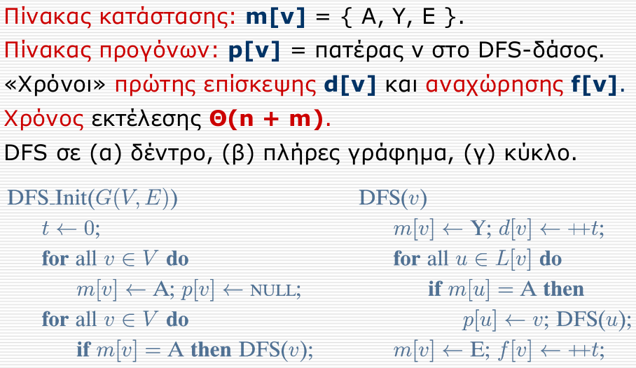
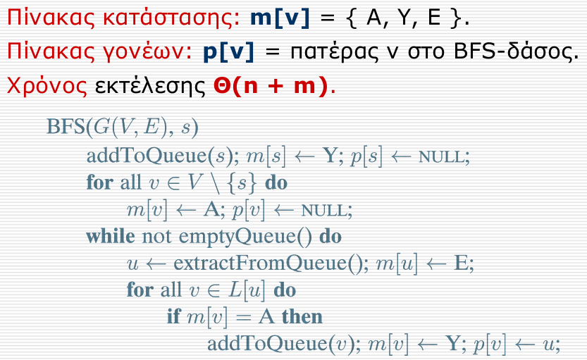
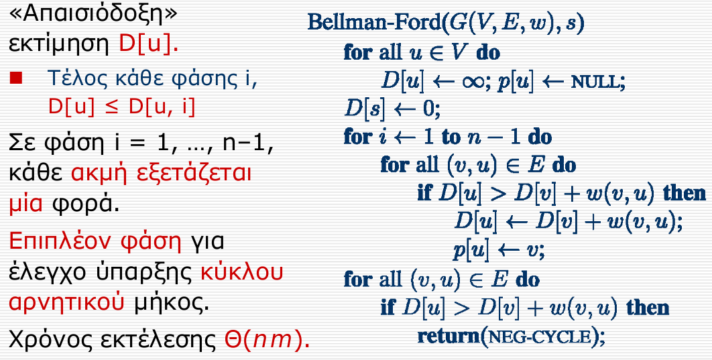
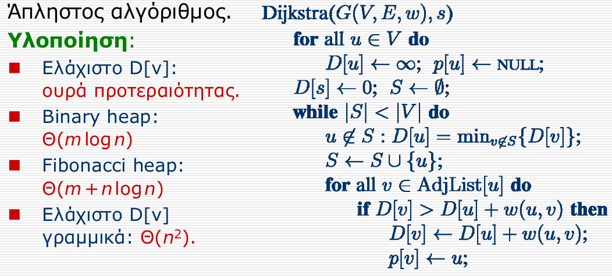
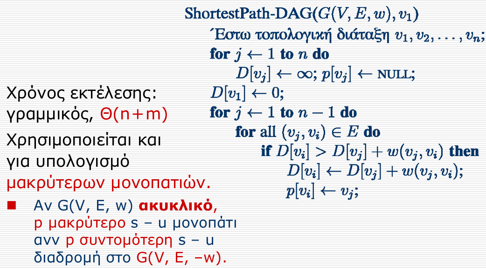
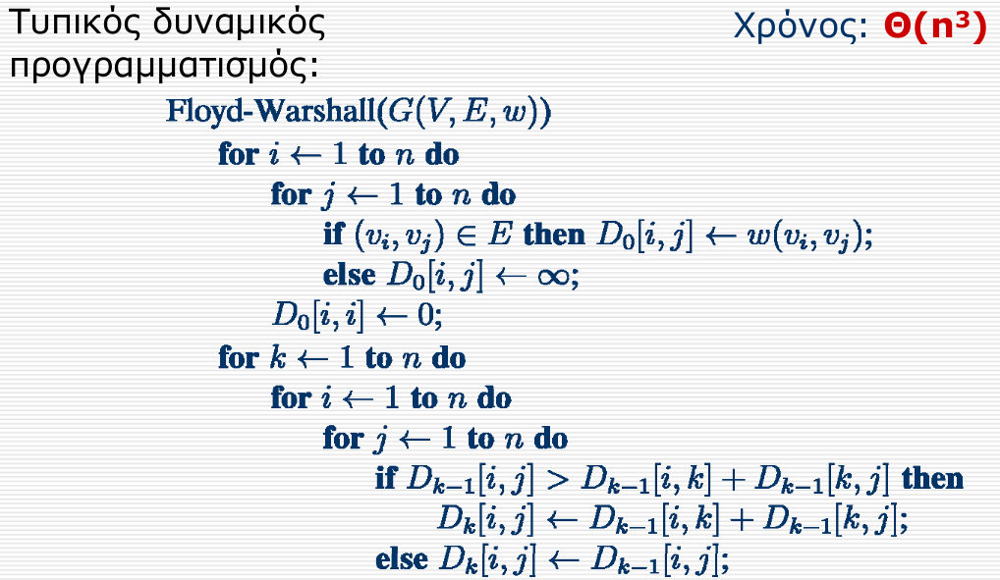
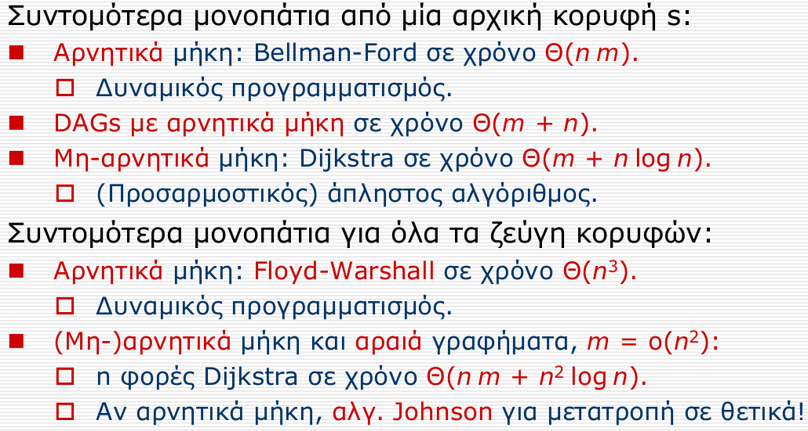
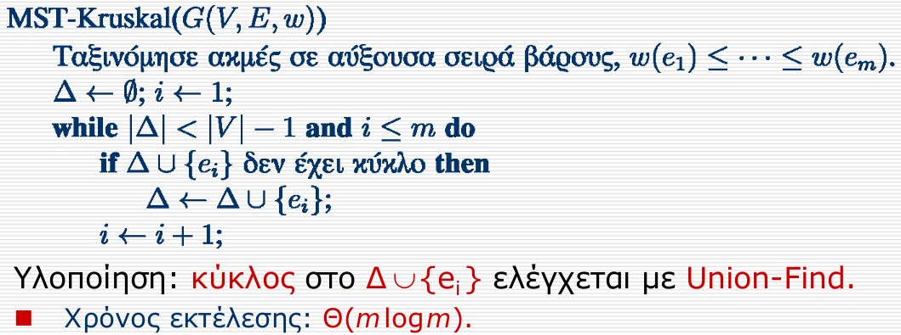
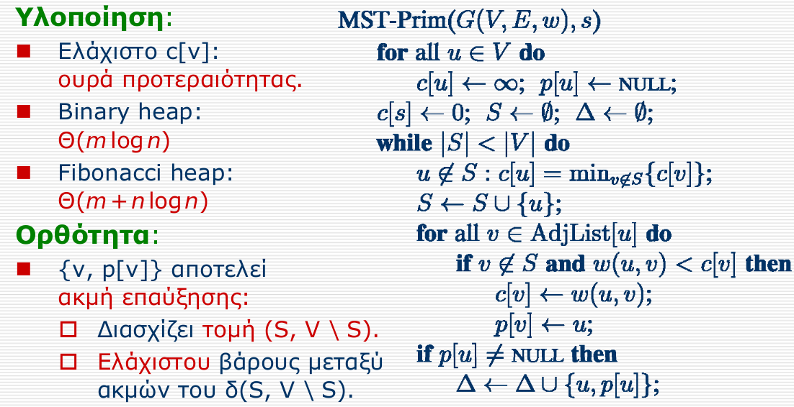

# Random Last Moment Notes
Credits to Prof Fotakis for the algorithm implementations

## Graph Search

Τρία είδη κορυφών: 
- Ανεξερεύνητη (A): όχι επίσκεψη ακόμη.
- Υπο-εξέταση (Y): επίσκεψη και εξερευνούμε γείτονες.
- Εξερευνημένη (E): ολοκλήρωση διαδικασίας

#### Complexity (Both BFS and DFS)

| Implementation | Complexity |
| :---: | :---: |
| Adjacency Matrix | `O(v²)` |
| Adjacency Lists | `O(v + e)` |

### DFS

#### Implementation



### BFS

Oλοκληρώνει εξερεύνηση κορυφών σε απόσταση k από s πριν επεκταθεί σε κορυφές σε απόσταση k+1.

#### Implementation



## Shortest Paths

### Bellman-Ford

D(u, i + 1) = min{ D(u, i), min { D(v, i) + w(v, u) } }

#### Implementation



### Dijkstra

#### Implementation



#### Complexity

(v = |V|, e = |E|)

| Implementation | Complexity |
| :---: | :---: |
| Adjacency Lists and Binary Heap | `O((v + e) log v)` |
| Adjacency Matrix and Binary Heap | `O(v² + e log v)` | `O(e log v)` |
| Adjacency Lists and Fibonacci Heap | `O(e + v log v)` |

### Shortest Path in DAG



### Floyd-Warshall



### Altogether



## Spanning Trees

### Kruskal



### Prim



### Maximum Spanning Tree
Run Kruskal choosing the max edge each time (works for Prim too) or negate the edges first.

## Flows

### [Ford-Fulkerson](https://www.geeksforgeeks.org/ford-fulkerson-algorithm-for-maximum-flow-problem/)

#### Implementation
```
flow = 0
while there is a augmenting path from source to sink (BFS-DFS): 
    flow += path_flow
return flow
```

#### Complexity

`O(|E| * f)`, `f` being the max flow

## Dynamic Programming

[
Maximum profit by buying and selling a share at most k times
](https://www.geeksforgeeks.org/maximum-profit-by-buying-and-selling-a-share-at-most-k-times/)

## NP-Completeness

### Longest Path

Reduction from the Hamiltonian Path Problem